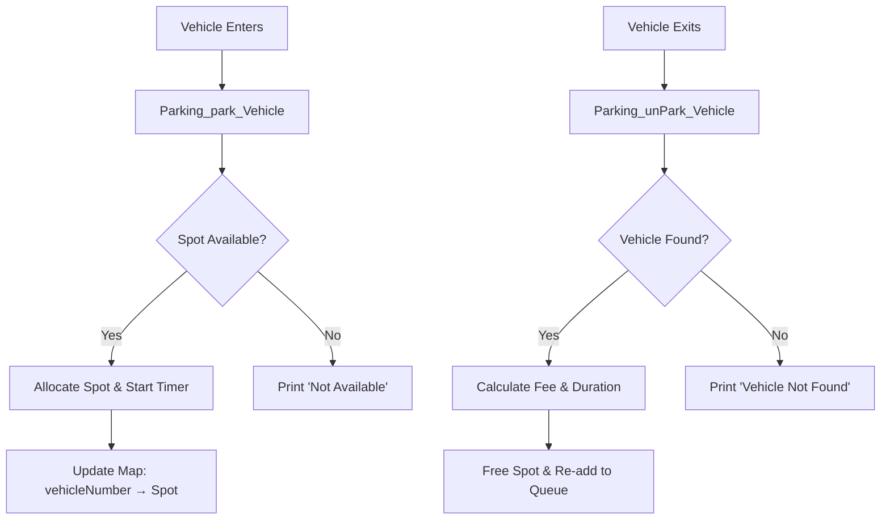

# 🚗 Parking Lot System (LLD - Java Implementation)

This project implements a thread-safe, in-memory Parking Lot system in Java as a part of Low-Level Design (LLD) practice. It supports vehicle parking/unparking, fare calculation, and real-time parking status updates.

---

## 🧱 Class Structure

```
com.syscho.lld.parkinglot
│
├── Parking.java           --> Main class managing parking logic and spots
├── ParkingSpot.java       --> Represents individual parking spots
├── Vehicle.java           --> Represents vehicles with type and number
├── VehicleType.java       --> Enum for vehicle types (CAR, BIKE)
└── ParkingMain.java       --> Entry point, simulates parking scenario
```

---

## 🧠 System Design Flow



---

## 🧮 Time Complexity

| Operation     | Method             | Time Complexity |
|---------------|--------------------|------------------|
| Park Vehicle  | `park()`           | O(1)             |
| Unpark Vehicle| `unPark()`         | O(1)             |
| Status Print  | `printStatus()`    | O(N)             |

Where `N` is the total number of parking spots.

---

## 🧵 Multithreading Support

- `ConcurrentHashMap` is used for `vehicleNumberToSpot` and `freeSpotsByType`.
- `ConcurrentLinkedQueue` used to ensure thread-safe spot allocation per vehicle type.
- Ready for concurrent `park()` and `unPark()` operations.

---

## 💸 Fee Calculation

- `BASE_PRICE = ₹20`
- `PER_MINUTES_CAR = ₹4`
- `PER_MINUTES_BIKE = ₹2`
- Duration calculated from time parked until unparked.

---

## 🧪 Sample Execution

```
Trying to park vehicles...
TA-2000 Parked at spot: spot2
...
Unparking few vehicles...
Unparked TA-2000 | Duration: 2 min | Fee: ₹20
...
```

---

## 🧱 Future Enhancements

- Multi-floor support
- Reservation system
- Dynamic pricing strategy
- REST API (Spring Boot)
- Real-time admin dashboard
- Subscription-based parking pass

---

## 🧑‍💻 Author

Praveen Soni | [GitHub](https://github.com/ps1437)
